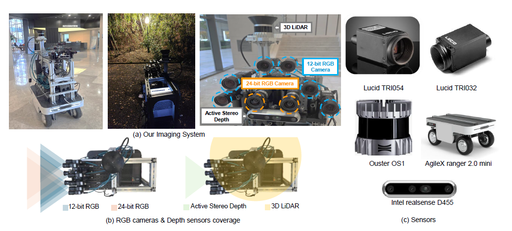
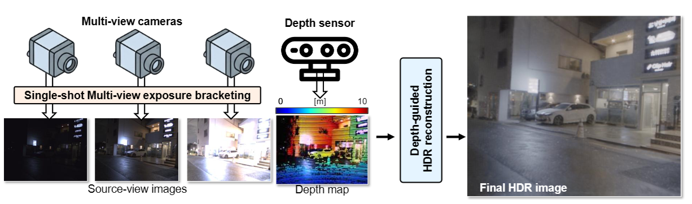

<!-- TODO FINAL: replace all [URL] placeholders before camera-ready -->

# DMEB: A Multi-View Varying-Exposure HDR Robot-Vision Benchmark

> **Project page:** https://divisonofficer.github.io/eccv2026/
> **Dataset & code:** this repository
> **Paper:** ECCV 2026 (Submission #8851) — *Datasets and Benchmarks track*

This repository hosts the **dataset, benchmark protocol, reference code, model
weights, and documentation** for our ECCV 2026 paper. Everything required to
reproduce the main results is **publicly available here** (no access request
required).

> The datasets, benchmark protocol, code, and documentation are publicly
> available at https://divisonofficer.github.io/eccv2026/.

---

## What this is

We introduce a **multi-view, varying-exposure HDR benchmark** for robot and
consumer vision, spanning a robot acquisition rig, an iPhone, and a CARLA-based
synthetic generator. The benchmark enables evaluation regimes prior HDR datasets
could not support: synchronized multi-view varying exposures, depth-guided HDR
reconstruction, and ablation over camera count and depth modality.


*Robot acquisition system: synchronized RGB cameras (12-bit and 24-bit HDR
reference) with LiDAR, active-stereo, and iToF depth.*

**DMEB** (Depth-Merged Exposure Bracketing) is provided as a **reference pipeline**
that validates the benchmark; it is a baseline/reference method, not the central
contribution. It performs single-shot multi-view exposure bracketing and fuses
the views with a depth sensor into a clean HDR image.



---

## Release-Scope Matrix

All four subsets claimed in the paper are released. This is a **processed
benchmark release**: it contains synchronized, calibrated, undistorted data
sufficient to reproduce every table and figure. Raw ROS bags / raw sensor
streams are **not** included (see *Not included* column).

| Subset | Public? | Download | Modalities provided | Not included | Paper tables/figures |
|---|---|---|---|---|---|
| **Robot — Modest DR** | ✅ v1.0 | [Google Drive](https://drive.google.com/drive/folders/1DJ6mOw3Y5VVNtvdoLCfY2SMBwGZkZk1z?usp=drive_link) | multi-view LDR (TIFF), HDR reference (EXR), LiDAR (Ouster), active-stereo depth (RealSense), iToF depth, intrinsics/extrinsics, timestamps, exposure/gain, valid masks | raw ROS bags | Tab. 2, Fig. 4 |
| **Robot — Ultra DR** | ✅ v1.0 | [Google Drive](https://drive.google.com/drive/folders/16HsC-HKVJ110RjrT_gNQ9ewEp5HLL7SQ?usp=drive_link) | single-shot LDR (EXR), burst-based HDR GT, depth, masks, scene metadata | raw burst frames | Tab. 2 (Ultra), Fig. 5 |
| **Synthetic — CARLA** | ✅ v1.0 | [Google Drive](https://drive.google.com/drive/folders/14broXSegL1aa204akX_ft8NZkQH60Jq-?usp=drive_link) | HDR GT (EXR), rendered LDR inputs, metric + sensor-like depth, camera config, generation metadata | CARLA engine assets (see license) | Tab. (synthetic), Fig. 7 |
| **iPhone** | ✅ v1.0 | [Google Drive](https://drive.google.com/drive/folders/1vW8jDhCQcoK5klad48aCyhtoI0oyttze?usp=drive_link) | wide/ultrawide/telephoto inputs, LiDAR, bracket-generated HDR GT, common-overlap masks | — | Tab. (iPhone), Fig. (iPhone) |
| **Benchmark protocol** | ✅ | [`dataset/benchmark_protocol.md`](dataset/benchmark_protocol.md) | dataset loader, evaluation script, metric config, valid-region rules | — | all metric tables |
| **Code (DMEB reference)** | ✅ | [`code/`](code/) | inference, evaluation, model weights, configs, minimal run example | full training pipeline | Tab. 2 |

The full dataset root is also available as a
[Google Drive folder](https://drive.google.com/drive/folders/1t1Hy2oellaAWjeIeyXrrq6RlCGXcOPB-?usp=drive_link).

**External datasets:** Results on *Choi et al. (CVPR'25)* are reproduced via the
authors' official release and our evaluation protocol; we do **not** redistribute
their data. See [`dataset/benchmark_protocol.md`](dataset/benchmark_protocol.md).

---

## Repository layout

```
eccv2026/
├── docs/         # GitHub Pages source → divisonofficer.github.io/eccv2026
├── dataset/      # dataset card, format, calibration, benchmark protocol
└── code/         # inference + evaluation + reference checkpoint
```

## Quick start

```bash
# 1. Download a subset (see Release-Scope Matrix above), then:
cd code
pip install -r requirements.txt

# 2. Reference-pipeline inference on one robot session
python inference.py --data_root /path/to/robot_modest_dr --ckpt /path/to/dmeb_ref.pth --output out/

# 3. Evaluate (PSNR-μ / SSIM, region-aware)
python eval.py --pred out/ --gt /path/to/robot_modest_dr
```

See [`code/README.md`](code/README.md) for details and
[`dataset/DATASET_CARD.md`](dataset/DATASET_CARD.md) for the full data
description.

## License

Data and code are released for **research use**; see [`LICENSE`](LICENSE) and the
per-subset terms in [`dataset/DATASET_CARD.md`](dataset/DATASET_CARD.md).

## Citation

```bibtex
@inproceedings{kim2026dmeb,
  title     = {DMEB: A Multi-View Varying-Exposure HDR Robot-Vision Benchmark},
  author    = {Jinnyeong Kim, Juhyung Choi, Woohyeok Kim, Sunghyun Cho, Seung-Hwan Baek
  },
  booktitle = {European Conference on Computer Vision (ECCV)},
  year      = {2026}
}
```
<!-- TODO FINAL: confirm final paper title matches camera-ready -->
